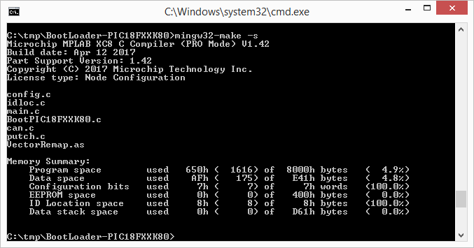
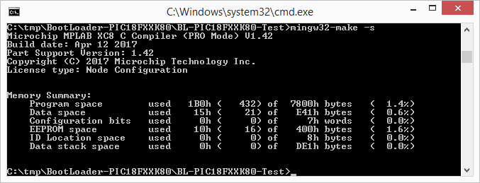
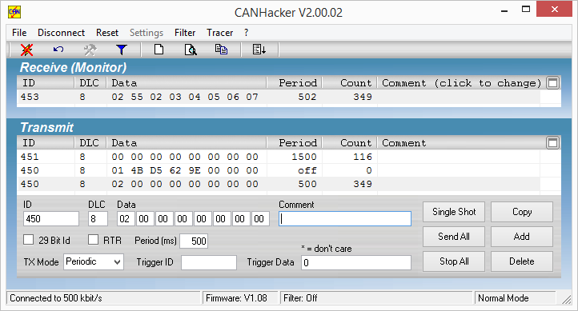
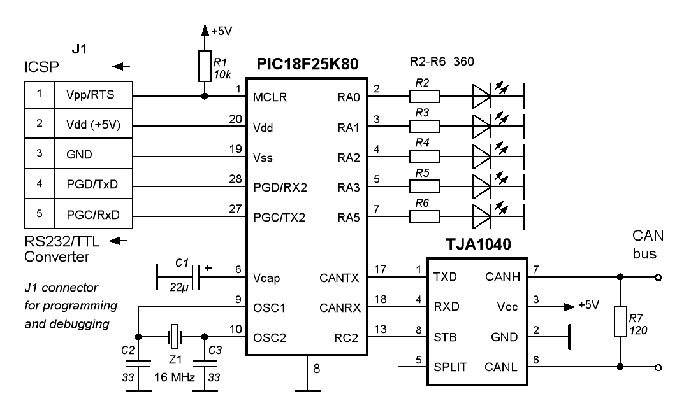

#### PIC18FXXK80-CAN-Bootloader

The main idea of this Bootloader is taken from 'Device - Boot Loader - HID' chapter in 'help\_mla\_usb' document from [Microchip Libraries for Applications](https://www.microchip.com/mplab/microchip-libraries-for-applications) collection. Read this chapter carefully.

The Bootloader firmware uses CAN as a transport instead USB.

One specific feature - each PIC18FXXK80 CAN node must have 32-bit unique identifier. It is stored in MCU's ID Locations (0x200000-0x200007). The [PC bootloader software](https://github.com/qnx425/mpcanflash) can find particular CAN node by this identifier.

To build firmware, it is need to install Microchip XC8 Compiler and MinGW.

Flash firmware with PICkit3. Then build the test application and download it.

Now you can check how the application works. Launch [CANHacker](https://cdn.hackaday.io/files/12644540960896/CANHackerV2.00.02.zip) and load [appropriate](test/mpcanflash.txl) Tx List configuration.

I tested it all on this equipment:

